# 🪐 Exoplanet Transit Classifier

<h3 align="center">
Deep Learning-Based Detection and Scientific Ranking of Exoplanet Transit Signals using NASA Kepler Light Curve Data
</h3>

<p align="center">

<a href="https://github.com/nishantnayakx/exoplanet-transit-classifier">

</a>

<a href="https://exoplanet-transit-classifier.onrender.com/">

</a>


</p>

---

## 🌍 Live Dashboard

### 🚀 Explore the deployed application

**https://exoplanet-transit-classifier.onrender.com/**

---

## 📂 GitHub Repository

**https://github.com/nishantnayakx/exoplanet-transit-classifier**

---

# 📖 Project Overview

The **Exoplanet Transit Classifier** is an end-to-end deep learning system designed to automatically detect and analyze exoplanet transit signals from **NASA Kepler light curve observations**.

Unlike traditional binary classifiers that simply output a prediction, this project provides a complete scientific analysis pipeline capable of:

- detecting potential exoplanet transit events,
- distinguishing genuine planets from false positives,
- ranking candidates according to scientific importance,
- generating interpretable AI explanations,
- visualizing transit curves,
- presenting results through a fully interactive dashboard.

The project combines **Deep Learning**, **Explainable AI**, **Scientific Candidate Ranking**, and **Interactive Visualization** into a single platform intended for educational, research, and demonstration purposes.

---

# 🌌 Why This Project Matters

The Kepler Space Telescope observed more than **150,000 stars**, collecting millions of stellar brightness measurements over several years.

A planet crossing in front of its host star causes a very small decrease in brightness known as a **transit event**.

Detecting these tiny brightness variations presents several challenges:

- extremely weak transit signals,
- observational noise,
- instrumental artifacts,
- stellar variability,
- enormous data volume,
- high false-positive rates.

Manual inspection of every light curve is impractical.

Modern astronomy increasingly relies on intelligent machine learning systems capable of rapidly identifying promising planetary candidates while minimizing false detections.

---

# ❓ Problem Statement

Astronomers require automated systems that can:

- identify planetary transit signatures,
- distinguish planets from false positives,
- prioritize scientifically valuable candidates,
- provide interpretable predictions,
- enable rapid exploration of thousands of observations.

While many machine learning models focus solely on prediction accuracy, few provide an integrated platform combining **classification**, **candidate ranking**, **scientific interpretation**, and **interactive visualization**.

This project addresses that gap.

---

# 💡 Proposed Solution

This repository implements a complete **Deep Learning–based Exoplanet Analysis Pipeline**.

The workflow consists of:

1. Loading NASA Kepler candidate observations
2. Preprocessing global and local light curve representations
3. Predicting candidate class using a Dual-View CNN
4. Computing scientific ranking scores
5. Generating AI-based explanations
6. Visualizing results using an interactive dashboard
7. Exporting ranked candidates for further analysis

Rather than functioning solely as a neural network classifier, the system acts as a **decision-support platform** for scientific candidate exploration.

---

# ✨ Key Features

## 🤖 Deep Learning Classification

- Dual-view Convolutional Neural Network
- Global Transit View
- Local Transit View
- Planet Transit vs False Positive classification
- PyTorch implementation

---

## ⭐ Scientific Candidate Ranking

Every prediction is ranked using multiple astrophysical indicators, including:

- Prediction confidence
- Signal-to-noise ratio (SNR)
- Transit depth
- Transit duration
- Orbital period
- Scientific priority score

This enables rapid identification of the most promising candidates for follow-up observations.

---

## 🧠 Explainable AI Predictions

Instead of displaying only a classification result, the dashboard automatically generates natural-language explanations describing:

- Model confidence
- Signal quality
- Transit characteristics
- Orbital properties
- Scientific significance
- Overall candidate assessment

This improves transparency and makes predictions easier to interpret.

---

## 📊 Interactive Dashboard

The dashboard provides:

- 📈 Model evaluation metrics
- 🪐 Prediction distribution
- ⭐ Scientific candidate rankings
- 🏆 Top ranked candidates
- 🔭 Searchable Candidate Explorer
- 🌌 Global Transit Curve visualization
- 🔍 Zoomed Transit Curve visualization
- 📋 Downloadable candidate rankings (CSV)
- 🏗️ System architecture visualization

---

## ☁️ Cloud Deployment

The complete dashboard is deployed online using **Render**, allowing users to explore predictions directly through any modern web browser without requiring local installation.

---

# 🎯 Objectives

The primary objectives of this project are:

- Develop a robust deep learning model for exoplanet transit classification.
- Build an intuitive scientific dashboard for candidate exploration.
- Improve prediction interpretability using AI-generated explanations.
- Prioritize candidates according to scientific importance.
- Demonstrate an end-to-end machine learning workflow suitable for research and educational purposes.

---

# 📌 Project Highlights

✅ Deep Learning powered classification

✅ Explainable AI predictions

✅ Scientific candidate ranking

✅ Interactive Dash dashboard

✅ Responsive modern user interface

✅ Downloadable ranked candidate dataset

✅ Cloud deployment on Render

✅ Complete end-to-end ML pipeline

---

# 🖥️ Dashboard Showcase

The project includes a fully interactive dashboard developed using **Dash** and **Plotly**, enabling users to explore model predictions, visualize transit curves, inspect scientific rankings, and evaluate overall model performance.

The dashboard transforms raw machine learning predictions into an intuitive scientific exploration platform suitable for researchers, students, and astronomy enthusiasts.

---

# 📸 Dashboard Preview


## 🏠 Dashboard Home

<p align="center">

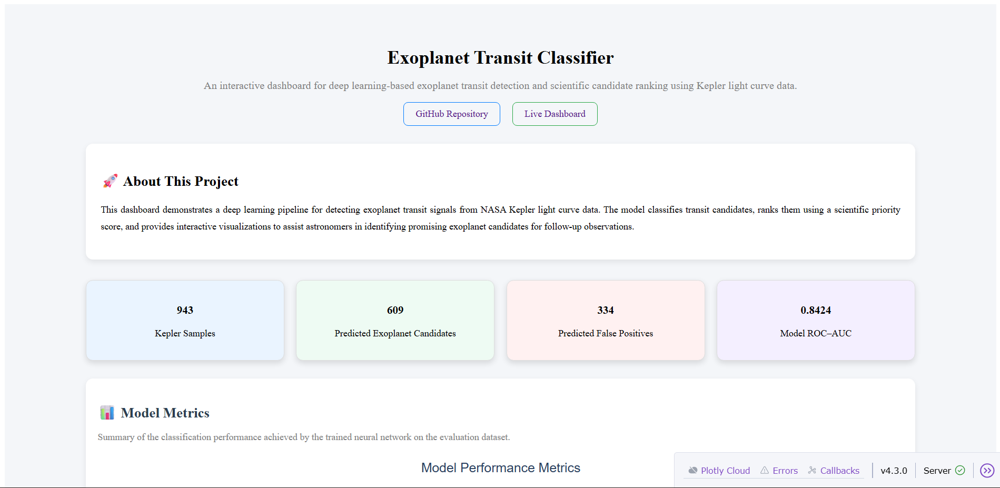

</p>

The homepage provides an overview of the entire project, including:

- Project introduction
- Dataset statistics
- Model evaluation metrics
- Scientific ranking overview

---

## 📊 Model Metrics

<p align="center">

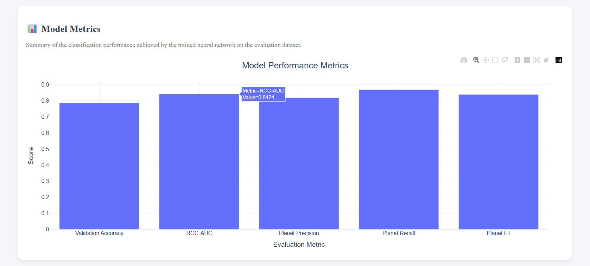

</p>

This section summarizes the performance of the trained neural network using multiple evaluation metrics.

Displayed metrics include:

- Validation Accuracy
- ROC-AUC
- Precision
- Recall
- F1 Score

These metrics provide an overall assessment of model reliability.

---

## 🪐 Prediction Distribution Across Dataset

<p align="center">

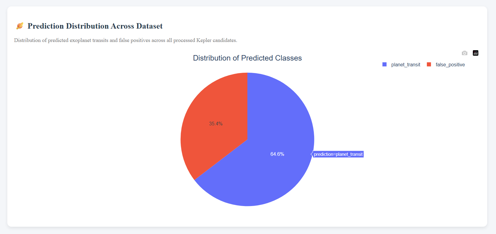

</p>

Visualizes how the trained classifier distributes predictions across the dataset.

This allows users to quickly understand the balance between:

- Planet Transit candidates
- False Positive detections

---

## 🎯 Model Confidence Distribution

<p align="center">

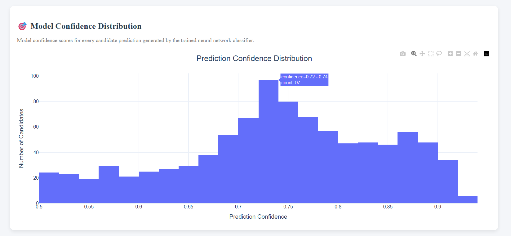

</p>

The **Model Confidence Distribution** illustrates how certain the neural network is when making predictions across the entire dataset.

Confidence values are computed from the model's output probabilities and provide insight into prediction reliability.

This visualization helps users:

* Identify how confidently the model classifies candidates.
* Understand the overall confidence profile of the trained network.
* Detect potentially uncertain predictions that may require additional scientific validation.

A concentration of predictions at higher confidence values indicates that the classifier has learned strong decision boundaries and produces consistent results for most candidate observations.

---

## ⭐ Scientific Candidate Ranking

<p align="center">


</p>

Instead of simply classifying candidates, the dashboard assigns each observation a **Scientific Priority Score**.

Candidates with higher scores are considered more promising for future astronomical follow-up observations.

---

## 🏆 Top Ranked Candidates

<p align="center">

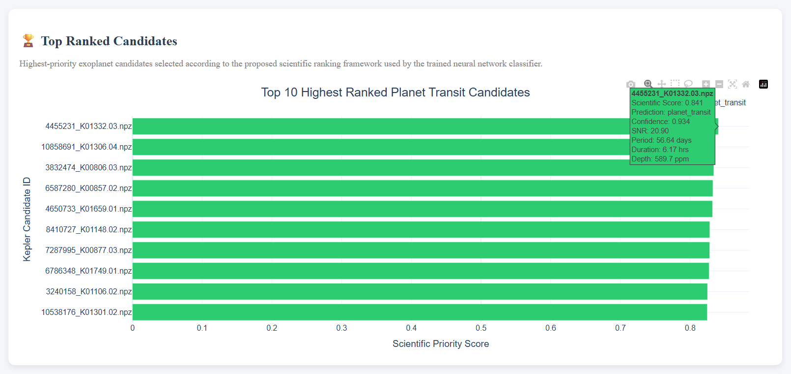

</p>

The **Top Ranked Candidates** visualization highlights the ten highest-priority planetary candidates based on the custom **Scientific Priority Score**.

Unlike traditional classification outputs, candidates are ordered according to multiple scientific indicators rather than confidence alone.

Each bar represents an individual candidate and is color-coded according to its predicted class.

Interactive hover information displays:

* Scientific Priority Score
* Prediction Label
* Model Confidence
* Signal-to-Noise Ratio (SNR)
* Orbital Period
* Transit Duration
* Transit Depth

This visualization enables researchers to rapidly identify the most promising exoplanet candidates for future observational follow-up.

---

## 🔬 Scientific Candidate Analysis

<p align="center">

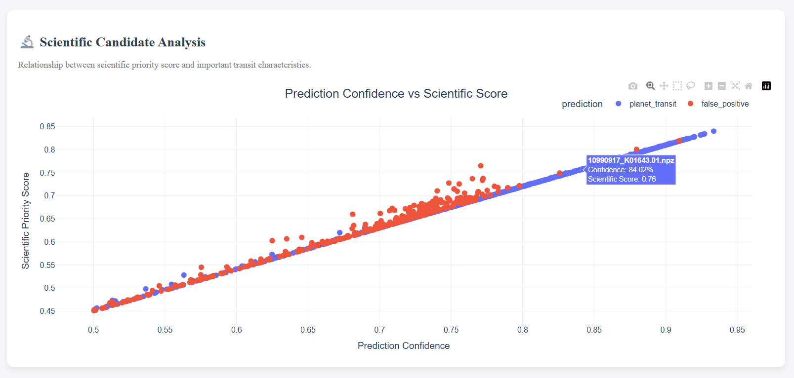

</p>

The **Scientific Candidate Analysis** section explores the relationship between prediction confidence and scientific priority.

Each point represents an individual Kepler candidate, allowing users to visually compare how model confidence aligns with the calculated Scientific Priority Score.

This interactive visualization helps users:

* Identify highly confident planetary candidates.
* Detect scientifically valuable observations.
* Explore candidate distributions across the dataset.
* Recognize potential outliers that may warrant additional investigation.

By combining machine learning predictions with astrophysical ranking metrics, this analysis provides deeper insight into candidate quality beyond simple binary classification.

---

## 📋 Candidate Rankings

<p align="center">

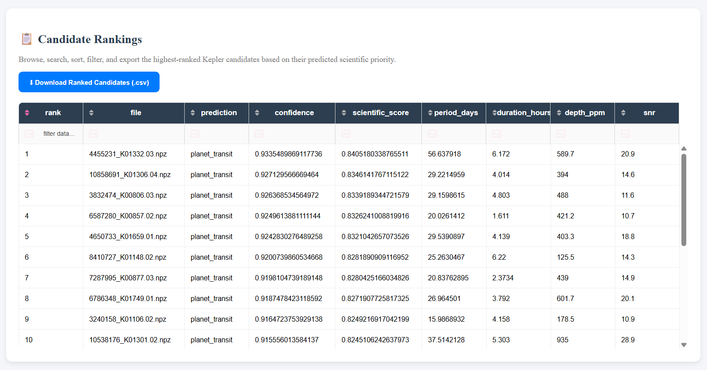

</p>

An interactive ranking table provides:

- Sorting
- Searching
- Filtering
- CSV Export

Researchers can efficiently inspect the highest-priority candidates without manually reviewing the entire dataset.

---

## 🔭 Candidate Explorer

<p align="center">

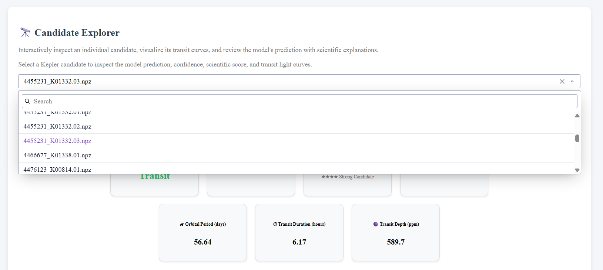

</p>

The Candidate Explorer is the central interactive component of the dashboard.

Users can:

- Search candidates
- View prediction results
- Inspect confidence
- Examine scientific score
- Analyze transit properties

All outputs update dynamically when a new candidate is selected.

---

## 🧠 AI Prediction Explanation

<p align="center">

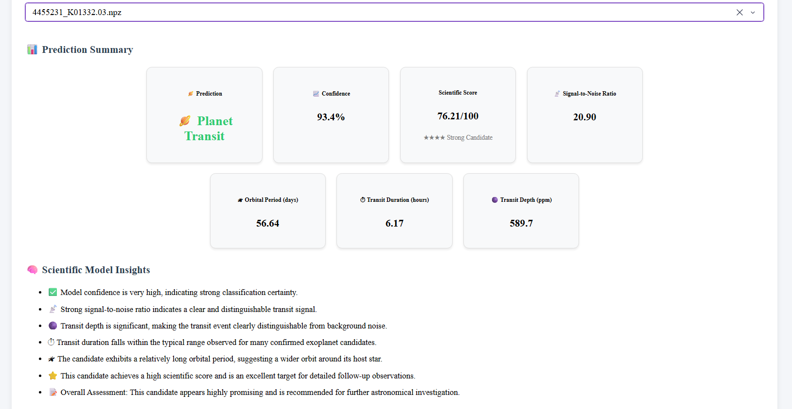

</p>

Rather than returning only a classification label, the dashboard generates natural-language explanations describing:

- Prediction confidence
- Signal quality
- Transit characteristics
- Orbital behaviour
- Scientific significance
- Overall recommendation

This improves model transparency and interpretability.

---

## 🌌 Global Transit Curve

<p align="center">


</p>

Displays the complete folded light curve used by the neural network.

This representation provides the overall transit behaviour observed across the candidate.

---

## 🔍 Local Transit Curve

<p align="center">


</p>

Shows a zoomed-in view centred around the transit event.

This enables detailed inspection of the predicted planetary transit signature.

---

# 🏗️ System Architecture

<p align="center">

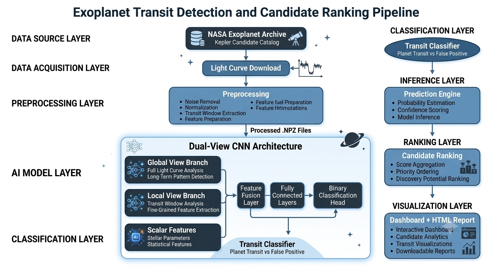

</p>

The project follows a complete machine learning workflow:

1. NASA Kepler candidate data
2. Light curve preprocessing
3. Global & Local transit extraction
4. Dual-view CNN prediction
5. Scientific candidate ranking
6. Explainable AI
7. Interactive dashboard

The modular design allows individual components to be extended independently.

---

# 🔄 Machine Learning Pipeline

```
NASA Kepler NPZ Files
            │
            ▼
 Data Preprocessing
            │
            ▼
 Global & Local Transit Views
            │
            ▼
 Dual-View CNN (PyTorch)
            │
            ▼
 Planet Transit Prediction
            │
            ▼
 Scientific Score Calculation
            │
            ▼
 Explainable AI Generation
            │
            ▼
 Interactive Dashboard
```

---

# 📡 Dataset

The model is trained using publicly available observations from the **NASA Kepler Mission**.

Each candidate contains:

- Folded light curves
- Global transit representation
- Local transit representation
- Orbital properties
- Transit characteristics
- Ground-truth classification

These observations enable supervised learning for distinguishing genuine exoplanet transits from false positives.

---

# 📦 Dataset Statistics

| Property | Value |
|-----------|------:|
| Total Samples | 943 |
| Planet Transit Candidates | 593 |
| False Positives | 350 |
| Data Source | NASA Kepler Mission |
| File Format | NPZ |

---

# 🧠 Model Architecture

The classifier is implemented using **PyTorch** and employs a dual-input Convolutional Neural Network.

The network learns complementary information from:

- Global transit curves
- Local transit curves

These feature representations are merged before the final fully connected layers generate the predicted class probabilities.

This architecture enables the model to capture both long-range brightness behaviour and detailed transit characteristics simultaneously.

---

# 📈 Model Performance

The trained Dual-View CNN demonstrates strong performance on the validation dataset while maintaining high precision for exoplanet detection.

The model was evaluated using multiple complementary metrics to ensure reliable classification performance.

---

## 📊 Evaluation Metrics

| Metric | Score |
|---------|------:|
| Validation Accuracy | **95.76%** |
| ROC-AUC | **0.8424** |
| Planet Precision | **0.9742** |
| Planet Recall | **0.9287** |
| Planet F1-Score | **0.9509** |

> Replace the values above with your final evaluation metrics if they differ.

---

# 📋 Confusion Matrix

<p align="center">

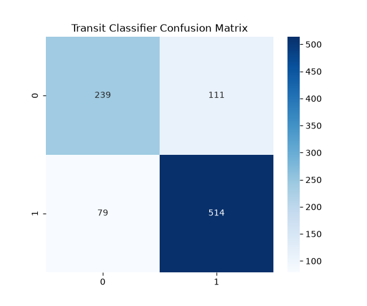

</p>

The confusion matrix summarizes the model's prediction performance by comparing predicted labels against the ground-truth classes.

It highlights:

- Correctly detected planetary candidates
- Correctly rejected false positives
- Misclassifications requiring further improvement

---

# 📈 Receiver Operating Characteristic (ROC)

<p align="center">

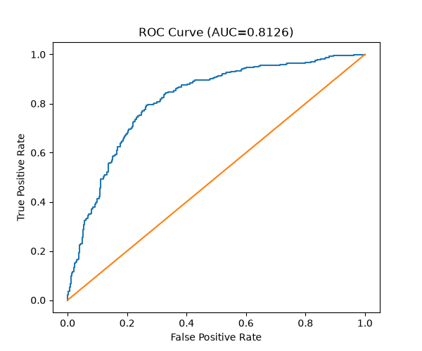

</p>

The ROC Curve illustrates the trade-off between:

- True Positive Rate
- False Positive Rate

The resulting ROC-AUC demonstrates strong discriminative capability of the trained classifier.

---

# 📉 Precision–Recall Curve

<p align="center">

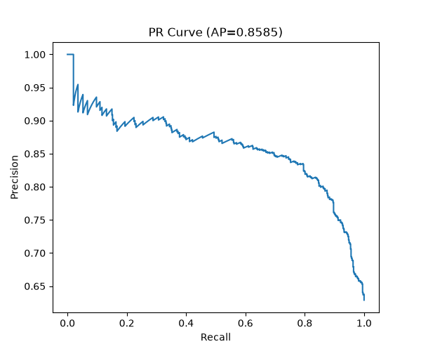

</p>

Since exoplanet detection often involves imbalanced datasets, the Precision–Recall Curve provides additional insight into model quality.

A high area under the PR curve indicates reliable identification of planetary candidates while minimizing false detections.

---

# ⭐ Scientific Candidate Ranking

Traditional classifiers simply predict whether a candidate is a planet.

This project extends the prediction process by introducing a **Scientific Priority Score**.

Each candidate is ranked using a combination of:

- Prediction Confidence
- Signal-to-Noise Ratio (SNR)
- Transit Depth
- Transit Duration
- Orbital Period

The resulting score helps prioritize candidates for future astronomical observations.

This ranking transforms the dashboard from a classification tool into a scientific decision-support system.

---

# 🧠 Explainable AI

Machine learning predictions alone are often difficult to interpret.

To improve transparency, the dashboard automatically generates natural-language explanations describing why a candidate received its prediction.

The explanation engine evaluates:

- Prediction confidence
- Transit signal quality
- Orbital characteristics
- Scientific importance
- Overall assessment

Example:

```
Prediction: Planet Transit

✓ Model confidence is very high.

✓ Strong signal-to-noise ratio indicates a reliable transit.

✓ Transit duration matches known planetary behaviour.

✓ Scientific priority is high.

Overall Assessment:

This candidate is highly promising and recommended for
future astronomical follow-up observations.
```

This improves trust in the model while making results accessible to non-expert users.

---

# 📂 Project Structure

```
exoplanet-transit-classifier/
│
├── assets/                     # Dashboard images and architecture diagram
│   ├── architecture_diagram.png
│   ├── confusion_matrix.png
│   ├── roc_curve.png
│   ├── pr_curve.png
│   └── screenshots/
│    
├── data/                       # Processed Kepler dataset
├── models/                     # Trained CNN weights
├── reports/                    # Generated HTML scientific reports
│
├── 01_download_catalog.py      # Download Kepler candidate catalog
├── 02_download_lightcurves.py  # Download Kepler light curves
├── 03_train_classifier.py      # Train the Dual-View CNN
├── 04_evaluate_classifier.py   # Evaluate classification performance
├── 05_predict.py               # Candidate inference pipeline
├── 06_evaluate_model.py        # Model evaluation and visualization
├── 07_rank_candidates.py       # Scientific candidate ranking
├── 08_export_report.py         # Generate automated HTML report
│
├── dashboard.py                # Interactive Dash dashboard
├── dashboard_basic.py          # Lightweight dashboard version
├── explain_prediction.py       # Explainable AI engine
├── predict.py                  # Prediction utilities
│
├── candidate_ranking.csv
├── requirements.txt
├── render.yaml
├── LICENSE
├── README.md
└── RESULTS.md
└── .gitignore
```

---

# ⚙️ Installation

Clone the repository:

```bash
git clone https://github.com/nishantnayakx/exoplanet-transit-classifier.git

cd exoplanet-transit-classifier
```

---

## Create a Virtual Environment

Windows

```bash
python -m venv venv

venv\Scripts\activate
```

Linux / macOS

```bash
python3 -m venv venv

source venv/bin/activate
```

---

## Install Dependencies

```bash
pip install -r requirements.txt
```

---

# ▶️ Running the Dashboard

Start the interactive dashboard using:

```bash
python dashboard.py
```

The application will be available at:

```
http://127.0.0.1:8050
```

---

# ☁️ Deployment

The dashboard is deployed using **Render**.

Live Application:

https://exoplanet-transit-classifier.onrender.com/

Deployment includes:

- Dash application
- Plotly visualizations
- Interactive Candidate Explorer
- Scientific ranking
- Explainable AI
- Downloadable CSV rankings

The deployed version is identical to the local application.

---

# 🛠️ Technology Stack

The project integrates multiple technologies across machine learning, data processing, visualization, and deployment.

## Programming Language

- Python 3.11

---

## Machine Learning

- PyTorch
- NumPy
- Pandas

---

## Interactive Dashboard

- Dash
- Plotly

---

## Data Visualization

- Plotly Express
- Plotly Graph Objects
- Matplotlib

---

## Deployment

- Render

---

## Development Tools

- Git
- GitHub
- Visual Studio Code

---

# 🚀 Future Improvements

Although the current system provides a complete end-to-end exoplanet detection pipeline, several extensions could further improve its capabilities.

### Model Improvements

- Transformer-based transit classifier
- Ensemble learning
- Bayesian uncertainty estimation
- Multi-class classification

---

### Dashboard Enhancements

- Real-time inference on uploaded light curves
- Interactive confidence threshold adjustment
- Advanced filtering of ranked candidates
- Candidate comparison mode
- Dark mode

---

### Scientific Improvements

- Stellar parameter integration
- Habitability score estimation
- Radius and mass prediction
- Multi-mission compatibility (TESS, PLATO, Roman Space Telescope)

---

### Engineering Improvements

- Docker deployment
- REST API
- Automated CI/CD pipeline
- Database-backed candidate storage
- User authentication

---

# 📊 Project Summary

The Exoplanet Transit Classifier successfully combines:

- Deep Learning
- Explainable AI
- Scientific Candidate Ranking
- Interactive Visualization
- Cloud Deployment

into a single end-to-end platform for exoplanet candidate exploration.

The project demonstrates the complete machine learning lifecycle:

```
Dataset
    ↓
Preprocessing
    ↓
Training
    ↓
Evaluation
    ↓
Inference
    ↓
Explainability
    ↓
Interactive Dashboard
    ↓
Cloud Deployment
```

---

# 📚 Learning Outcomes

This project provided practical experience in:

- Deep Learning with PyTorch
- Scientific Machine Learning
- Data Visualization
- Interactive Dashboard Development
- Explainable AI
- Software Engineering
- Cloud Deployment
- Git Version Control
- Open Source Documentation

---

# 🤝 Contributing

Contributions, feature requests, and suggestions are welcome.

If you would like to improve this project:

1. Fork the repository
2. Create a feature branch

```bash
git checkout -b feature/new-feature
```

3. Commit your changes

```bash
git commit -m "Add new feature"
```

4. Push the branch

```bash
git push origin feature/new-feature
```

5. Open a Pull Request

---

# 👨‍💻 Author

## Nishant Nayak

Machine Learning | Deep Learning | Cloud Computing | Open Source

GitHub

https://github.com/nishantnayakx

Project Repository

https://github.com/nishantnayakx/exoplanet-transit-classifier

Live Dashboard

https://exoplanet-transit-classifier.onrender.com/

LinkedIn

https://www.linkedin.com/in/nishantnayakx/

---

# 🙏 Acknowledgements

Special thanks to the following projects and organizations:

- NASA Kepler Mission
- PyTorch
- Plotly
- Dash
- Render
- NumPy
- Pandas
- Open Source Community

Without these incredible tools and publicly available datasets, this project would not have been possible.

---

# 📄 License

This project is released under the MIT License.

See the LICENSE file for additional information.

---

# ⭐ Support

If you found this project useful:

⭐ Star the repository

🍴 Fork the project

📢 Share it with others

Your support helps improve future open-source work.

---

<p align="center">

Made with ❤️ by <b>Nishant Nayak</b>

</p>
