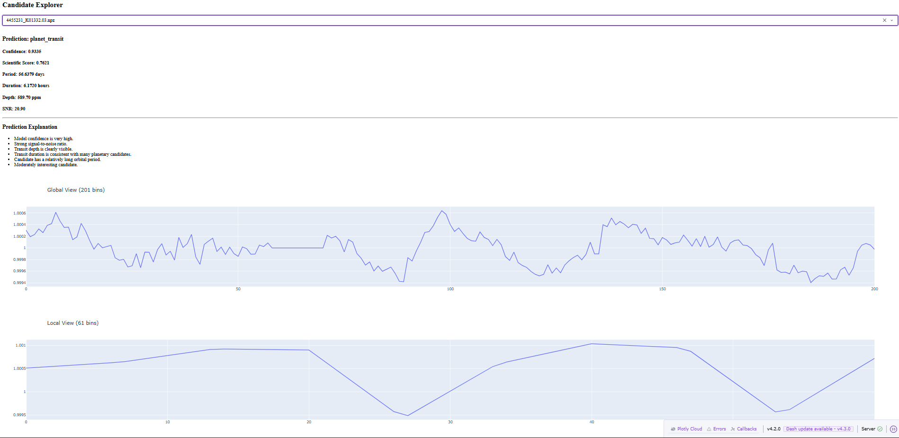

 
# Exoplanet Transit Classifier

## Overview

An end-to-end machine learning system for detecting exoplanet transit candidates from astronomical light-curve data using a dual-view Convolutional Neural Network (CNN).

The project processes phase-folded light curves, extracts global and local transit views, combines them with astrophysical features, and classifies candidates as either:

* Planet Transit
* False Positive

The repository includes data processing, model training, evaluation, inference, and an interactive dashboard for visualization.

---

## Live Demo

Production Dashboard:

https://exoplanet-transit-classifier.onrender.com

---

## Dashboard Versions

### Production Dashboard (`dashboard.py`)

The production dashboard is deployed on Render and optimized for cloud hosting.

Features:

* Dataset Overview
* Prediction Distribution
* Confidence Distribution
* Candidate Rankings
* ROC Curve
* Precision-Recall Curve
* Confusion Matrix
* Architecture Diagram

Run locally:

```bash
python dashboard.py
```

---

### Development Dashboard (`dashboard_dev.py`)

The development dashboard provides the complete research interface.

Additional Features:

* Real-time candidate inference
* Candidate Explorer
* Global View visualization
* Local View visualization
* Transit statistics inspection
* Prediction explanation support

Run locally:

```bash
python dashboard_dev.py
```
---

## Problem Statement

Exoplanets are commonly detected using the transit method, where a planet passes in front of its host star and causes a small dip in brightness.

Modern surveys generate thousands of candidate signals. Manual inspection is expensive and time-consuming.

This project applies deep learning to automatically classify transit candidates and assist in identifying potential exoplanets.

---

## Dataset

### Processed Candidate Signals

* Total Samples: 943
* Planet Transits: 593
* False Positives: 350

Each processed sample contains:

* Global Transit View (201 bins)
* Local Transit View (61 bins)
* Orbital Period
* Transit Duration
* Transit Depth
* Signal-to-Noise Ratio (SNR)

---

## Installation

```bash
git clone https://github.com/nishantnayakx/exoplanet-transit-classifier.git

cd exoplanet-transit-classifier

pip install -r requirements.txt
```
---

## Model Architecture

### Inputs

1. Global View (201 bins)
2. Local View (61 bins)
3. Scalar Features

   * Period
   * Duration
   * Depth
   * SNR

### Architecture

Global View → CNN Branch

Local View → CNN Branch

Scalar Features → Dense Layer

Feature Fusion → Fully Connected Layers

Output → Planet Transit / False Positive


---

## Features

- Dual-View CNN Architecture
- Global and Local Transit Light Curve Analysis
- Automated Candidate Ranking
- Scientific Score Calculation
- Interactive Dash Dashboard
- Candidate Explorer
- ROC Curve Evaluation
- Precision-Recall Evaluation
- HTML Scientific Report Generation
- Prediction Explainability

---

## Research Highlights

- Developed a dual-view CNN for exoplanet transit classification.
- Achieved ROC-AUC of 0.8424.
- Ranked 943 processed Kepler candidates.
- Generated scientific candidate rankings using astrophysical metrics.
- Built an interactive Dash dashboard.
- Deployed a cloud-hosted dashboard on Render.

---

## Results

Model Evaluation:

- Validation Accuracy: 78.7%
- ROC-AUC: 0.8424
- Planet Precision: 0.82
- Planet Recall: 0.87
- Planet F1 Score: 0.84


### Validation Performance

| Metric              | Value  |
| ------------------- | ------ |
| Validation Accuracy | 78.7%  |
| ROC-AUC             | 0.8424 |
| Planet Precision    | 0.82   |
| Planet Recall       | 0.87   |
| Planet F1 Score     | 0.84   |

### Confusion Matrix

```text
[[239 111]
 [ 79 514]]
```

Overall Accuracy: **80%**

---

## Top Scientific Candidate

| Rank | Candidate | Confidence | Scientific Score |
|------|------------|------------|------------------|
| 1 | 4455231_K01332.03 | 93.35% | 0.8405 |

Characteristics:

- Period: 56.64 days
- Duration: 6.17 hours
- Transit Depth: 589.7 ppm
- SNR: 20.9

---

## Visual Results

### Confusion Matrix


---

## Additional Evaluation Metrics

### ROC Curve


The model achieved an ROC-AUC score of **0.8424**, demonstrating strong discrimination between exoplanet transit candidates and false positives.

### Precision-Recall Curve


The Precision-Recall curve highlights the classifier's ability to maintain high precision while retrieving a large fraction of true exoplanet candidates.

---

## Inference

Predict a candidate signal:

```bash
python 05_predict.py path/to/sample.npz
```

Example Output:

```text
Prediction
----------------------------------------
Class      : planet_transit
Confidence : 0.7629
```

---

## Interactive Dashboard

The project includes a Dash-powered dashboard for exploring predictions and candidate transit signals.

Features:

- Dataset overview
- Model metrics
- Prediction distribution
- Confidence distribution
- Confusion Matrix
- Top-ranked candidates
- Candidate explorer
- Prediction Confidence
- Global view visualization
- Local view visualization
- Transit statistics

### Production Dashboard

```bash
python dashboard.py
```

### Development Dashboard

```bash
python dashboard_dev.py
```

### Dashboard Preview


Features:

* Dataset Overview
* Model Metrics
* Prediction distribution
* Confidence distribution
* Confusion Matrix
* Top-ranked candidates
* Candidate Explorer
* Prediction Confidence
* Global View Visualization
* Local View Visualization
* Transit statistics

Open:

```text
http://127.0.0.1:8050
```

### Prediction Explanation Engine

The dashboard includes an explainability module that converts model outputs into human-readable scientific reasoning.

Example explanations:

- Strong signal-to-noise ratio
- Transit depth consistent with planetary candidates
- Long orbital period
- High-priority follow-up candidate

#### Example



---

## Candidate Ranking System

After inference, all processed Kepler candidates are ranked according to:

- Model confidence
- Scientific Score
- Transit depth
- Signal-to-noise ratio (SNR)
- Transit duration
- Orbital period

The ranking pipeline generates:

candidate_ranking.csv

containing the most promising exoplanet candidates.

Example:

| Rank | Candidate | Confidence |
|------|------------|------------|
| 1 | K01332.03 | 0.9335 |
| 2 | K01306.04 | 0.9271 |
| 3 | K00806.03 | 0.9263 |

---

## System Workflow

Kepler Candidate Data

↓

Light Curve Processing

↓

Global & Local Transit Views

↓

Dual-View CNN Classification

↓

Candidate Ranking

↓

Scientific Report Generation

↓

Interactive Dashboard

---

## Scientific Report

The pipeline automatically generates an HTML report summarizing:

- Dataset statistics
- Model performance
- Candidate rankings
- Scientific metrics

Output:

reports/exoplanet_report.html

---

## Advanced Features

### Candidate Ranking System

The project ranks all processed exoplanet candidates using model confidence and scientific transit characteristics.

Generated file:

candidate_ranking.csv

Contains:

- Rank
- Prediction
- Confidence
- Scientific Score
- Period
- Duration
- Transit Depth
- Signal-to-Noise Ratio

Top candidates can be inspected directly from the dashboard.

---

### Prediction Explanation Engine

The explain_prediction module provides human-readable reasoning behind model predictions.

Example:

- High confidence planet transit
- Strong signal-to-noise ratio
- Transit depth consistent with planetary events
- Stable local transit profile

This helps interpret why the model classified a candidate as a likely exoplanet.

---

### Interactive Candidate Explorer

Dashboard features:

- Candidate selection dropdown
- Prediction label
- Confidence score
- Orbital period
- Transit duration
- Transit depth
- Signal-to-noise ratio
- Global View graph (201 bins)
- Local View graph (61 bins)

This allows visual inspection of every processed candidate.

---

## Project Structure

```text
├── dashboard.py
├── dashboard_dev.py
├── predict.py
├── explain_prediction.py            # interpretable prediction explanations
│
├── candidate_ranking.csv            # ranked output of all candidates
│
├── reports/
│   └── exoplanet_report.html
│
├── data/
├── assets/
│   ├── architecture_diagram.png
│   ├── dashboard_full.png
|   ├── dashboard_explanation.png
│   ├── confusion_matrix.png
│   ├── roc_curve.png
│   └── pr_curve.png
├── models/
|
├── 01_download_catalog.py
├── 02_download_lightcurves.py
├── 03_train_classifier.py
├── 04_evaluate_classifier.py
├── 05_predict.py
├── 06_evaluate_model.py
├── 07_rank_candidates.py            # ranks candidates by confidence and scientific score
├── 08_export_report.py
│
├── README.md
├── LICENSE
├── requirements.txt
└── CITATION.cff
```

---

## Technologies Used

* Python
* PyTorch
* NumPy
* Pandas
* Plotly
* Dash

---

## Future Improvements

- SHAP-based model explainability
- Automated transit visualization generation
- Multi-class astrophysical event classification
- NASA Exoplanet Archive integration
- Improved candidate ranking methodology
- Streamlit and Dash cloud deployment options

---

## Citation

If you use this project in research or educational work, please cite it using the provided CITATION.cff file.

---

## Author

Nishant Nayak

GitHub:
https://github.com/nishantnayakx
