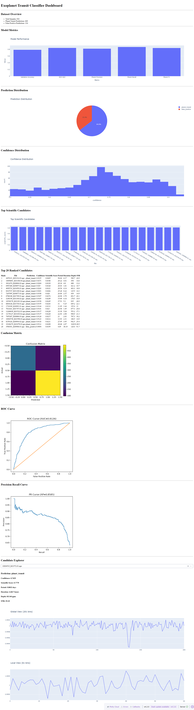

# Exoplanet Transit Classifier

## Overview

An end-to-end machine learning system for detecting exoplanet transit candidates from astronomical light-curve data using a dual-view Convolutional Neural Network (CNN).

The project processes phase-folded light curves, extracts global and local transit views, combines them with astrophysical features, and classifies candidates as either:

* Planet Transit
* False Positive

The repository includes data processing, model training, evaluation, inference, and an interactive dashboard for visualization.

---

## Problem Statement

Exoplanets are commonly detected using the transit method, where a planet passes in front of its host star and causes a small dip in brightness.

Modern surveys generate thousands of candidate signals. Manual inspection is expensive and time-consuming.

This project applies deep learning to automatically classify transit candidates and assist in identifying potential exoplanets.

---

## Dataset

### Processed Candidate Signals

* Total Samples: 943
* Planet Transits: 593
* False Positives: 350

Each processed sample contains:

* Global Transit View (201 bins)
* Local Transit View (61 bins)
* Orbital Period
* Transit Duration
* Transit Depth
* Signal-to-Noise Ratio (SNR)

---

## Model Architecture

### Inputs

1. Global View (201 bins)
2. Local View (61 bins)
3. Scalar Features

   * Period
   * Duration
   * Depth
   * SNR

### Architecture

Global View → CNN Branch

Local View → CNN Branch

Scalar Features → Dense Layer

Feature Fusion → Fully Connected Layers

Output → Planet Transit / False Positive

---

## Results

### Validation Performance

| Metric              | Value  |
| ------------------- | ------ |
| Validation Accuracy | 78.7%  |
| ROC-AUC             | 0.8424 |
| Planet Precision    | 0.82   |
| Planet Recall       | 0.87   |
| Planet F1 Score     | 0.84   |

### Confusion Matrix

```text
[[239 111]
 [ 79 514]]
```

Overall Accuracy: **80%**

---

## Visual Results

### Confusion Matrix


---

## Inference

Predict a candidate signal:

```bash
python 05_predict.py path/to/sample.npz
```

Example Output:

```text
Prediction
----------------------------------------
Class      : planet_transit
Confidence : 0.7629
```

---

## Interactive Dashboard

### Dashboard Preview



Launch the dashboard:

```bash
python dashboard.py
```

Features:

* Dataset Overview
* Model Metrics
* Confusion Matrix
* Candidate Explorer
* Prediction Confidence
* Global View Visualization
* Local View Visualization

Open:

```text
http://127.0.0.1:8050
```

---

## Project Structure

```text
data/
assets/
models/

01_download_catalog.py
02_download_lightcurves.py
03_train_classifier.py
05_predict.py
predict.py
dashboard.py
README.md
```

---

## Technologies Used

* Python
* PyTorch
* NumPy
* Pandas
* Plotly
* Dash

---

## Future Improvements

* Larger dataset collection
* Hyperparameter optimization
* Explainable AI methods
* Additional astrophysical features
* Cloud deployment
* Multi-class classification

---

## Author

Nishant Nayak

GitHub:
https://github.com/nishantnayakx
